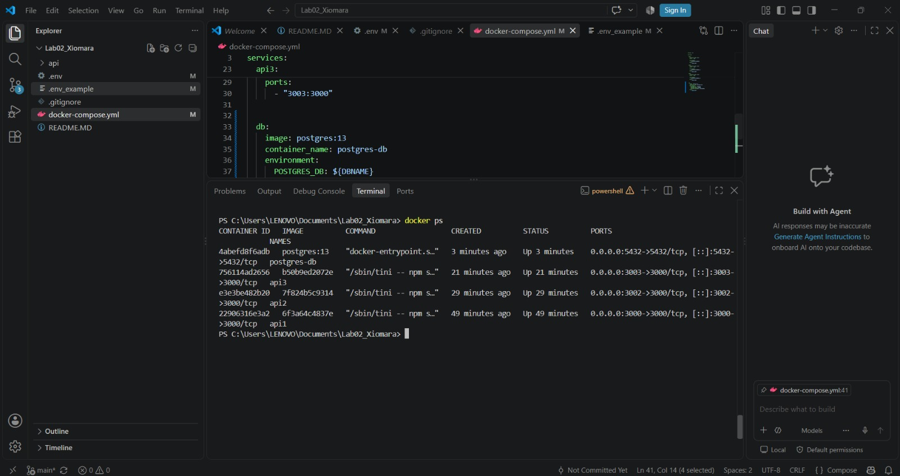
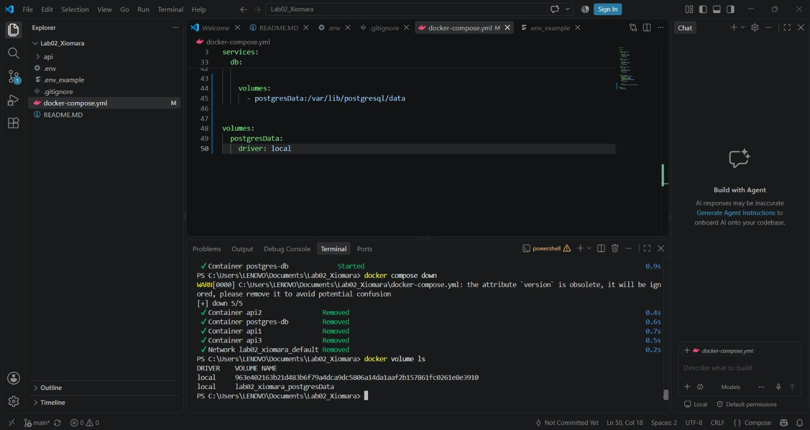

En README. Responder los tipos de redes y los tipos de volumen que existen en docker

## Tipos de redes

Docker tiene varias formas de conectar los contenedores

- **bridge:** Es la más usada. Conecta contenedores que están en la misma máquina
- **host:** El contenedor usa la red del equipo principal, como si fuera él
- **overlay:** Conecta contenedores que están en equipos diferentes
- **macvlan:** Le da al contenedor su propia dirección MAC. Aparece en la red como otro dispositivo más
- **none:** Deja al contenedor sin red.

## Tipos de volúmenes

Sirven para guardar la info de los contenedores

- **Volume nombrado:** Lo administra Docker. Es el mejor para cosas importantes como una base de datos
- **Bind mount:** Conecta una carpeta de tu PC con el contenedor. Se usa mucho para programar
- **tmpfs:** Guarda todo en la RAM. Cuando apagas el contenedor se borra todo.

## Capturas de prueba

